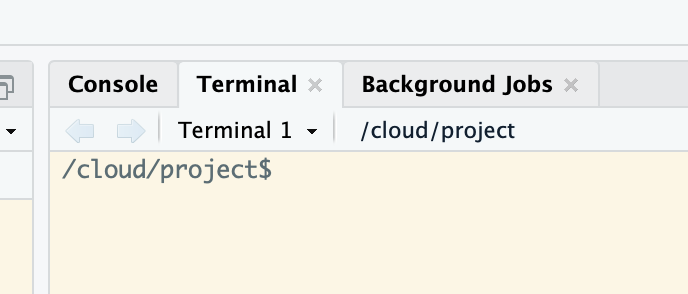
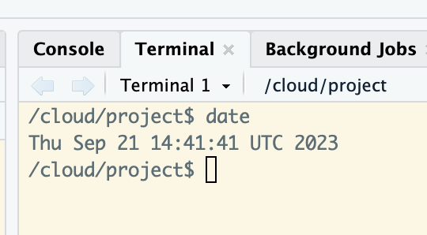

# Unix {#Unix}

```{r , echo=FALSE, eval=TRUE, include=TRUE}
klippy::klippy(c('r', 'bash'), position = c('top', 'right'), tooltip_message = 'copy to clipboard', tooltip_success = 'Copied!')
```

Unix is very likely the most fundamental skillset we can develop for bioinformatics (and beyond bioinformatics). Many of the most common and powerful bioinformatics approaches happen in this text-based environment, and having a solid foundation here can make everything we're trying to learn and do much easier. This is a short introductory tutorial to help us get from being completely new to Unix up to being acquainted with it 🙂.

## What is Unix/Linux?

UNIX is a computer operating system. It was first developed in 1969 at Bell Labs. Unix is written in the programming language `C`. Unix is proprietary software, whereas Linux is *basically* a free and open-source version of Unix. Most supercomputers run Linux. Operationally Linux is almost identical to Unix, and so we refer to it under the umbrella term of "unix-like" systems. The 'Li' in Linux is from the person who led its creation, Linus Torvalds.

### Some terms

Here are terms and concepts worth knowing.

```{r, echo=FALSE, eval=TRUE}
terms <- readr::read_csv("data/terms-1.csv", skip_empty_rows = TRUE) 

knitr::kable(terms, booktabs = TRUE,
             col.names = c("Term", "What it is"),
             longtable=TRUE) %>%
  kableExtra::row_spec(0, bold = TRUE) %>%
  kableExtra::kable_styling()
```

> **Note**
>
> You are familiar with using a GUI (Windows, iOS, Android, and MacOS are all GUIs), but to program a computer, you need to use a CLI (command line interface).

## Why Learn Unix?

Most sequencing data files are large and require a lot of computer memory (RAM) to process. As a result most of the work that bioinformaticians do is not hosted on their own laptops or desktops. Instead, they "remote-connect" to high performance supercomputers or computer clusters. Almost all of these high performance computers use "Unix-like" operating systems, the most common of which is Linux.

As stated above, Linux is free and open-source so there are lots of developers for it, which has helped Linux become stable, secure, reliable, and efficient.

Today, you will get some experience with using a Linux OS. By logging into posit.cloud in your browser, you are connecting to the company Posit's supercomputer, which runs Linux, and on top of Linux, Posit lets you run RStudio, which is a GUI for the statistics program called R. (Confusing? Yes. Linux is an operating system with a CLI shell, on which the RStudio GUI-shell runs, to make it easier to run the **R language** CLI shell.)

When you click on RStudio's Terminal tab, you get access to a *Linux* CLI bash shell, where you can execute commands and functions directly in Linux. (yes, now you have gone from RStudio's GUI back to the Linux CLI). All these different shells give us the ability to use multiple programs & programming languages. 

> **Note**
>
> This series of practicals is designed for you to have a first introduction to Bioinformatics. It's about **exposure**, not memorising or mastering anything. Don't worry about the details!

## Getting started

Before we get started we need a terminal to work in.

-   Click on the `6013A-Bioinformatics Skills I and II`  RStudio Project in your `BIO-6013A` workspace
-   Click on the `Terminal` tab next to `Console` tab in the RStudio GUI. This opens a command-line *Shell*

```{r, eval=TRUE,echo=FALSE, fig.cap='Here is an example of the Terminal tab, right next to the R console', out.width='80%', fig.asp=.75, fig.align='center'}

```

-   This is our "command line" where we will be typing all of our commands. We type our commands in a language called `bash`

-   The \$ is where you start typing from, left of this it tells your `working directory`, which is the folder you are currently in. 

-   If you need to, you can exit the Terminal and start a new session. 

## A few foundational rules

-   Spaces are special and break things apart. As a rule it is better to have functions and file names with dashes (-) or underscores (\_) where you want space to be. Thus, "draft_v3.txt" refers to one file, while "draft v3.txt" refers to *two* files:  draft and v3.txt.

-   The general syntax on the bash command line is: `command argument`. Argument is a special term and it means all the extra text bits that customise your command. This is similar to R except we don't use brackets e.g. in R we put the arguments inside parentheses `command(argument)`

-   Arguments can be **optional** e.g. if their is a default argument you may not have to write anything. Some functions *require* that arguments are specified. Again this is just like R.

## Let's get started

We will perform a very simple function and get a flavour of the similarities and differences to working in `R`.

`date` is a command that prints out the date and time. Type `date` into your terminal

This prints out the date/time in UTC format

```{r, eval=TRUE,echo=FALSE, fig.cap='It should look like this:', out.width='80%', fig.asp=.75, fig.align='center'}

```

Now let's add an argument to the `date` command to ask for the date next Tuesday. `date` is the command, and `--date="next tue"` is the argument that causes the `date` command to modify its output. This argument is optional, as you have seen. Often, commands have required arguments.

```{bash}
date --date="next tue"
```

The `date` command can do lots of things. You can learn more about about it [here](https://www.geeksforgeeks.org/date-command-linux-examples/). #{.uri}

Occasionally and alternatively, you set an *environmental* variable to get a command to function differently. For instance, we might want to tell the computer that we are in the London time zone. We do it this way:

```{bash}
TZ=Europe/London date
```

and if we want to find the time in Paris

```{bash}
TZ=Europe/Paris date
```


### Downloading data

We will start by typing in an instruction to download data from an online data repository, unpack the contents, and inspect it.

-   `curl` is a command line tool for transferring data to and from a remote computer server. Here we will use this to download data from an online repository called Figshare, and the `-o` argument sets the filename of the downloaded file (i.e. you can choose what to name the downloaded file). 

-   `tar` *unpacks* and *uncompresses* the data from a tarballed and compressed file format. A compressed file format (known as gzipped) makes a large file smaller for download. A tarball format makes many individual files appear as one single file. In this example, you have downloaded a whole directory with over a hundred individual files, and Figshare has tarballed and compressed the directory so that it is easy to download. You therefore need a command to *extract* the files from the tarball and *unzip* the files Can you guess which two arguments of the four here `tar -xzvf` tell the computer to do these two things? 

-   `rm` removes the original downloaded file, which you had called `unix_intro.tar.gz`

-   after untarballing and extracting, we have a new directory called `unix_intro/`. Can you find it in the Files tab of RStudio? 

- `ls -l` lists the files in the working directory, and the `-l` asks for a particular format that I like. Can you see the new directory called `unix_intro`?

-   `cd` changes your working directory so we *land* in the new folder we have made. # When we write the name of a directory in Unix, we have the option to add a `/` at the end of the name. This slash is only decorative, but it's useful when you are reading bash scripts. 

Use the copy icon in the top right of the code block to copy all 3 commands and paste them into the Terminal. If this seems onerous to you, you are right. There is a keyboard shortcut for sending commands to the terminal. On Macs, it is opt-cmd-enter. On Windows, you can find the shortcut by opening Tools/Keyboard Shortcuts Help/ and looking for Send to Terminal under the Execute submenu.

```{bash}
curl -L -o unix_intro.tar.gz https://ndownloader.figshare.com/files/15573746

tar -xzvf unix_intro.tar.gz

rm unix_intro.tar.gz

ls -l 

cd unix_intro/ 
```

```{block, type="rmdwarning"}

Check each command line has run, in the example above you might find that the last line to change directory doesn't run until you hit enter inside the Terminal

```

### More functions

Before the next step, make sure that you are in the `unix_intro/` directory. **You should see `unix_intro$` in the command line.**

Unlike `date`, most commands require arguments and won't work without them. `head` is a command that prints the first lines of a file, so of course it requires the filename:

```{bash}
ls -l # do you see the file called example.txt?

# if I precede a line with # (a hash), then bash knows to ignore it. This is how we can add comments inside a script

head example.txt
```

Here "example.txt" is the required argument, and in this case it is also what's known as a positional argument. Whether things need to be provided as positional arguments or not depends on how the command or program we are using was written.

Sometimes we need to specify the input file by putting something in front of it (e.g. some commands will use the -i flag, but it's often other things as well).

<details>

<summary>**Q. What's in the text file? - Click here for Answer**</summary>

*Pretty boring, each line contains the text "This is line" followed by the line number e.g.*

*- This is line 1*

*- This is line 2*

*etc.*

</details>

There are also optional arguments for the head command. The default for head is to print the first 10 lines of a file. We can change that by specifying the -n flag, followed by how many lines we want:

```{bash}
head -n 20 example.txt
```

How would we know we needed the `-n` flag for that? There are a few ways to find out. Many standard Unix commands and other programs will have built-in help menus that we can access by providing --help as the only argument:

```{bash}
head --help
```

Well, as it happens, the command `head` does not have a help menu, but it still gives you some help when you try.

Again this is very similar to the logic in which R commands are structured e.g. `?ggplot` The syntax is similar even if the specific icons or arguments are different.

Remember just like with R, one of your best friends is Google! As you get familiar with any language or OS we might remember a few flags or specific options, but searching for options and details when needed is definitely the norm!

## Unix File Structure

There are two special locations in all Unix-based systems: the "root" location and the current user's "home" location. "Root" is where the address system of the computer starts; "home" is usually where the current user's location starts.

Just to be awkward, Posit Cloud actually has us working in a different location "Cloud", which is underneath Root but separate to home which would be in the "Users" folder.

```{r, eval=TRUE,echo=FALSE, out.width='80%', fig.asp=.75, fig.align='center'}
knitr::include_graphics("images/file_system_structure.png")
```

We tell the command line where files and directories are located by pre-pending the file name with the list of directories that hold them, known as the file's "path". If we use the `pwd` command (for print working directory), we can find out what the path is for the directory we are sitting in. Our working directory is also visible to the left of the \$ in the command line

```{bash}
pwd
```

And if we use the `ls -l` command (for list), we can see what directories and files are in the current directory we are sitting in. (Note the `-l` argument) (also, try `ls –-help`) (that's 2 dashes in front of `help`)

```{bash}
ls -l
```

> **Note**
>
> Why is it important to know this? Usually when you are working on a Unix-like environment there is no GUI (a click and point interface), and all commands have to be submitted through the terminal. So you have to get used to navigating directories with typed commands, and it's useful to know what the standard hierarchy is and where you happen to be at any given moment.

## Absolute vs relative file paths

You should be used to these concepts from your work with R projects.

There are two ways to specify the path (address) of the file we want to do something to:

-   An **absolute path** is an address that starts from an explicitly specified location: usually the "root" `/` or the "home" `~/` location. (Side note, because we also may see or hear the term, the "full path", is usually the absolute path that starts from the "root" /.)

-   A **relative path** is an address that starts from wherever we are currently sitting (the working directory). For example, let's look again at the head command we ran above:

```{bash}
head example.txt
```

What we are actually doing here is using a relative path to specify where the "example.txt" file is located. This is because the command line **automatically looks** in the current working directory if we don't specify anything else about its location.

We can also run the same command on the same file using an **absolute path** - note Posit Cloud has a slightly unique set-up in that we start from a folder called cloud:

```{bash}
head /cloud/project/unix_intro/example.txt
```

The previous two commands both point to the same file right now. **But the first way, `head example.txt`, will only work if we are "sitting" in the directory that holds that file, while the second way will work no matter where we happen to be in the computer.**

It is **important to always think about where we are in the computer** when working at the command line. One of the most common errors/easiest mistakes to make is trying to do something to a file that isn't where we think it is. Let's run head on the "example.txt" file again, and then let's try it on another file: "notes.txt":

```{bash}
head example.txt
```

```{bash}
head notes.txt
```

Here the head command works fine on "example.txt", but we get an error message when we call it on "notes.txt" telling us no such file or directory. If we run the `ls` command to list the contents of the current working directory, we can see the computer is absolutely right -- spoiler alert: it usually is -- and there is no file here named "notes.txt".

The ls command by default operates on the current working directory if we don't specify any location, but we can tell it to list the contents of a different directory by providing it as a positional argument:

```{bash}
ls -lF
```

By running ls without each argument, can you understand what the -l and -F arguments are doing?

```{bash}
ls -lF experiment
```

We can see the file we were looking for is located in the subdirectory called "experiment". Here is how we can run head on "notes.txt" by specifying an accurate relative path to that file:

```{bash}
head experiment/notes.txt
```

## Moving around

We can also move into the directory containing the file we want to work with by using the `cd` command (**c**hange **d**irectory). This command takes a positional argument that is the path (address) of the directory we want to change into. This can be a relative path or an absolute path. Here we'll use the relative path of the subdirectory, "experiment", to change into it

```{bash}
cd experiment/
```

```{bash}
pwd
```

```{bash}
ls -lF
```

```{bash}
head notes.txt
```

Great. But now how do we get **back "up"** to the directory above us? One way would be to provide an absolute path, like `cd /cloud/project/unix_intro`, but there is also a handy shortcut. `..` which are special characters that act as a relative path specifying "up" one level -- one directory -- from wherever we currently are.

So we can provide that as the positional argument to cd to get back to where we started:

```{bash}
cd ..
```

Moving around the computer like this might feel a bit cumbersome and frustrating at first, but after spending a little time with it, you will get used to it, and it starts to feel more natural.

> **Note**
>
> One way to speed things up is to start using **tab** to perform **tab-completion** often this will auto-complete file names! Press tab twice quickly and it will print all possible combinations.

## Summary

While maybe not all that exciting, these commands really are the foundation needed to start utilizing the command line -- which then gives us the capability to use lots of tools that only work at the command line to manipulate **big data** and to rapidly access and work with remote computers, and more!

### Terms

```{r, echo=FALSE, eval=TRUE}
terms <- readr::read_csv("data/terms.csv", skip_empty_rows = TRUE) 

knitr::kable(terms, booktabs = TRUE,
             col.names = c("Term", "What it is"),
             longtable=TRUE) %>%
  kableExtra::row_spec(0, bold = TRUE) %>%
  kableExtra::kable_styling()
```

### Commands

```{r, echo=FALSE, eval=TRUE}
terms <- readr::read_csv("data/commands.csv", skip_empty_rows = TRUE) 

knitr::kable(terms, booktabs = TRUE,
             col.names = c("Command", "What it is"),
             longtable=TRUE) %>%
  kableExtra::row_spec(0, bold = TRUE) %>%
  kableExtra::kable_styling()
```

### Special characters for the `cd` command

```{r, echo=FALSE, eval=TRUE}
terms <- readr::read_csv("data/characters.csv", skip_empty_rows = TRUE) 

knitr::kable(terms, booktabs = TRUE,
             col.names = c("Command", "What it is"),
             longtable=TRUE) %>%
  kableExtra::row_spec(0, bold = TRUE) %>%
  kableExtra::kable_styling()
```

In a single session, you won't get used to operating in bash, or moving around directories using just the command line. So if you think you are interested in developing your bioinformatic skills, carve out a chunk of time to practise.

Here is a link to a couple of extended tutorials you can bookmark if you want to explore this further:

<https://datacarpentry.org/shell-genomics/index.html>

## Stretch yourself - optional extras to try a couple of other skills

### Creation

I want to create a new directory, use `mkdir` to create a new directory called Code:

<details>

<summary>**Check you are in the `unix_intro` folder - Click on the arrow for Answer**</summary>

```{bash}
pwd
```

</details>

<details>

<summary>**Make a new directory called TEST inside unix_intro/ - Click on the arrow for Answer**</summary>

```{bash}
cd /cloud/project/unix_intro/

mkdir TEST
```

</details>

<details>

<summary>**Check this folder has been created using a list function**</summary>

```{bash}
ls -lF
```

</details>

Note that I used a relative file path to create the TEST/ directory (because I first navigated to the location where i want the TEST/ directory) - but I could have also specified an absolute filepath to generate that folder in whatever location I want.

There are a few ways to make new files on the command line. The simplest is to generate a blank file with the `touch` command followed by the path (relative or absolute) to the file you want to create

<details>

<summary>**Make a new text file inside the TEST/ directory, called data-science-class.txt - Click here for Answer**</summary>

```{bash}
touch TEST/data-science-class.txt

ls -lF TEST/
```

*Note here I could just use ls to list all files and folders in a directory, but if i set the flag `-l` then it will produce a **l**ong list of files.*

*If the entry in the first column is a `d`, then the row in the table corresponds to a directory, otherwise the information in the row corresponds to a file.*

*The string of characters following the `d` in the case of a directory or following the first `-` in the case of a file represent the permissions for that file or directory - I won't cover that here - but some of the links I provide go into more detail.*

</details>
