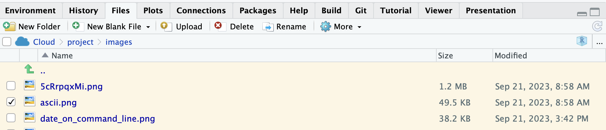

# BLAST {#BLAST}

```{r setup, include = FALSE}
knitr::opts_chunk$set(eval = FALSE)
```

Lets take a moment to review some terminology.

-   **Unix** - An operating system analogous with Windows.
-   **Shell** - This is the interface we use to talk to the computer. If we are able to use the mouse to point and click we are using a Graphical User Interface (GUI). If we are only using text we are using a Command Line Interface (CLI). We will be using a CLI in these workshops.
-   **Command-line and Terminal** - A text-based environment for sending commands to a computer's operating system or to an application. The terminal is the app that gives you access to the operating system's command line. It's called terminal because there literally used to be a tv screen at the end (terminus) of a cable from a mainframe computer.
-   **bash** - a programming language used to run a series of Unix commands and programs that run on Unix. Bash scripts can be used to automated large amounts of bioinformatic work, and are known as pipelines.

Make sure that the the tab in the left panel is set to **Terminal** and NOT Console. You will be running commands in the Terminal. (N.B. If RStudio goes to sleep and you resume it, RStudio will put you in the Console, not the Terminal, so you have to click on the Terminal tab to get back to the Terminal.)

## Directories and their structure

Working with text-based interfaces, where you are writing and running commands, means that we need to have some understanding of how files are organised within directories ("folders") and why it's important to know which directory you are working in. Basically, you cannot open a file by pointing at it in a window. You need to write down the address to the file, which is known as the file's *path*. To do that, you need to have a starting point for the path.

Under **Files** in the bottom right panel of your screen you will see a file with the ending .Rproj. This is an R project file which tells R your starting point for navigating directories. It means that R will automatically treat the directory with the .Rproj file as the **working directory**. If you wish to access files outside of the working directory, you need to tell the program the **file path** that to the file(s).

Look at the top of the File panel. You will

```{r, eval=TRUE, echo=FALSE, fig.cap="The current directory in this image is /Cloud/project/images/, where the final / indicates that images/ is a directory, not a file. In Posit.cloud, /cloud is the 'root' directory. If a file's path is written out all the way from the root, it is known as the absolute path, e.g. /cloud/project/images/ascii.png", out.width='80%', fig.asp=.75, fig.align='center'}

```

### Moving around folders/directories

Look in the 'files' tab in the panel to the bottom right. You should have three folders stored there, called;

-   data
-   plots
-   project_setup

You can move around folders/directories in the command line, and it's good to be comfortable doing this. Make sure you are in the `Terminal` tab in the panel to the bottom left and go to the `/cloud/project` directory with the `cd` command. (`cd` is shorthand for change directory, and remember to hit **enter**).

```         
cd /cloud/project
```

Because we use `/cloud/` at the beginning, we are using the absolute path to the `project/` directory. Now list the files in this directory.

```         
ls -lF
```

The `ls` command is shorthand for list, the `-l` argument means long listing format, and the `-F` argument means to classify the items by their type. Unix allows you to combine arguments into a single thing, to speed up typing. So `ls -l -F` is usually written as `ls -lF`. In fact, one way to think about Unix is that the commands are designed by people who like to use the command line but hate the act of typing, so all the commands are very short. If you get good at Unix, you will become like this.

The terminal should return something that looks like this, and you will see that `code/` and `data/` are directories (because of the forward slashes).

```         
/cloud/project$ ls -lF
total 12
drwxrwx--- 2 r574796 rstudio-user 4096 Sep 22 07:07 code/
drwxrwx--- 6 r574796 rstudio-user 4096 Sep 22 06:56 data/
-rw-rw-r-- 1 r574796 rstudio-user  205 Sep 22 11:07 project.Rproj
```

Let's go and have a look at the files held within `data`. Use following command;

```         
cd data/
```

now use

```         
ls -lF
```

The terminal should return something that looks like this, showing four subdirectories underneath the `data/` directory (which is itself a subdirectory of `project/`

```         
/cloud/project/data$ ls -lF
total 16
drwxrwx--- 2 r574796 rstudio-user 4096 Sep 22 06:56 blast/
drwxrwx--- 2 r574796 rstudio-user 4096 Sep 22 06:56 databases/
drwxrwx--- 2 r574796 rstudio-user 4096 Sep 22 06:56 query/
drwxrwx--- 2 r574796 rstudio-user 4096 Sep 22 06:56 refseq/
```

So you can see that you can use commands like `ls` and `cd` to move around your directories.

Note - if you want to move back up a directory level you can use `cd ..` to do so. `..` means up, and you can see the two dots at the top of the file list in the Files panel. If you click on those two dots, you also move up a directory level.

Use `cd, ls and cd ..` to explore the directories available to you in your project.

### Paths

So hopefully you are getting comfortable moving between directories in the terminal. Here I will briefly introduce you to paths. Type in the following so that everyone is in the same location;

```         
cd /cloud/project/
```

If you want to enter some commands from this location that use the `mouse.1.protein.faa` file stored in the `refseq` directory you will need to provide a path for the location that file. These paths can either be absolute or relative.

Relative paths provide a pathway from your current directory (in this case `/cloud/project/`). So to get to the directory where your `mouse.1.protein.faa` file is you could use the following path;

```         
data/refseq
```

However if you are already in the `databases` directory, this path wont work because your computer will be looking for directories it cant see. This is where absolute paths come in useful.

Absolute paths specify the location of a file or directory in relation to your root directory `/` (the top most directory in a hierarchy). So it doesn't matter which directory you are currently in, the pathway will work. In this case the absolute path would be;

```         
/cloud/project/data/refseq
```

Have a go at using both absolute and relative paths with the `cd` command to move around your directories.

## File types

When we look at sequence data there are a number of file types that you will regularly come into contact with. The most common of these are .fastq and .fasta files. Here we will have a look at some key features and differences of these file types.

Fastq files are used as a data storage file for the output from Illumina sequencers. The structure of a .fastq file is very uniform, each DNA sequence has four lines dedicated to it.

-   Line 1 - begins with an '\@' character and is followed by an identifier and optional description. For example it may contain information about the sequencer, the flow cell, index number etc. The identifier is unique to each sequence.
-   Line 2 - is the DNA sequence
-   Line 3 - a '+' character (and sometimes a repeat of line 1)
-   Line 4 - computer readable information relating to the quality for the sequence in line 2. There is the same number of characters as the sequence. The letters indicate the probability of error and are known as phred scores, coded as ASCII characters

An example of three sequences from an Illumina sequencer in .fastq format is shown below. The `A` phred ASCII code translates to a phred score of 32, which means that there is a $1/1585$ probability that the nucleotide `G` is incorrect (see <https://en.wikipedia.org/wiki/Phred_quality_score> and <https://support.illumina.com/help/BaseSpace_OLH_009008/Content/Source/Informatics/BS/QualityScoreEncoding_swBS.htm>)

```         
@NB501793:9:H77L2BGX2:1:11101:26113:7113 1:N:0:ATCACGAT
GCATGTCTCTAGTTCCGGAACCAAAATCTCCTCCACCCACTCTGCGTCCTGCTGACTATAGGAGATAAAGGCGTCATAGCAGAGGGTGGCGCCTCCTTGGTGCACCGCCGGCTTTCGCTTCGCCTTAAACCAGGCGACGGACATTTTCAGG
+
AAAAAEEEEEEEEEEEEEEEEEEEEEEEEEEEEEEEEEEEEEEEEEEEEEEEEEEEEEEEEEEEEEEEEEEEEEEEEEEEAEEEEEEEEEAEEEEEEEEEEEEEEAAEEEEEEEEEAAEE<AEEEEEEEEEEEEEEEEEEAEEEEEEE<EA
@NB501793:9:H77L2BGX2:1:11101:24170:10019 1:N:0:ATCACGAT
GCATGTCAACATCATTCTTGTTTTGTTAGAGCCACTACCTACATATCTTATCCCTTCCAAGTACTACCAGCTAAAGGCAATGATACATGC
+
AAAAAEA/EEEE/EEEEEEEEEEEAEEEEEEEEEEEEEEEEEEEEEAEAEAEEEAEEEEEEEEEEEEEEAEEE/EEEEEEAE/E/AEEAE
@NB501793:9:H77L2BGX2:1:11101:7027:14110 1:N:0:ATCACGAT
GCATGTGATGTTGTGTTTTTGTACTCTCCTCTCACTTTGTCCAAAGTGAGTGGTGTCATTATGAGTTGTATTTTGCTAACCACCAGAGACTAACACGAGGGCTGGACAACATCATTCTAGTTTTGTTAGAGCCACTACCTACATATC
+
AAA/AEEEEEEEEEEEEEEEEAEAAEEEEAAEEEEEEE/EEEAEEEEA/EE6EEEEEEEEEEEE6EE/EAEEE/EEEAAEAEEE/EEEEEE6EEEAE/<EAEEEEEE/EEAEEAE<E//AE<</EAEA//<<<A6AE/EEEE/A/EA
```

Fasta files are a simpler (and thus smaller) text-based file format for representing both nucleotide and amino acid sequences. These can be produced from .fastq files (but fastq files cannot be produced from fasta files). Each sequence in .fasta format comes with a *header line* which is marked by a '\>' character prefix. Information following the '\>' typically contains a sequence identifier and optional description of the sequence.

An example of three sequences from an Illumina sequencer in .fasta format is shown below, you may notice that these are the same sequences as shown above in the .fastq example; typically, the header lines in fasta files are more human-readable (i.e. *not* `>NB501793:9:H77L2BGX2:1:11101:26113:7113 1:N:0:ATCACGAT`)

```         
>NB501793:9:H77L2BGX2:1:11101:26113:7113 1:N:0:ATCACGAT
CTCTAGTTCCGGAACCAAAATCTCCTCCACCCACTCTGCGTCCTGCTGACTATAGGAGATAAAGGCGTCATAGCAGAGGGTGGCGCCTCCTTGGTGCACCGCCGGCTTTCGCTTCGCCTTAAACCAGGCGACGGACATTTTCAGG
>NB501793:9:H77L2BGX2:1:11101:24170:10019 1:N:0:ATCACGAT
CAACATCATTCTTGTTTTGTTAGAGCCACTACCTACATATCTTATCCCTTCCAAGTACTACCAGCTAAAGGCAATGATACATGC
>NB501793:9:H77L2BGX2:1:11101:7027:14110 1:N:0:ATCACGAT
GATGTTGTGTTTTTGTACTCTCCTCTCACTTTGTCCAAAGTGAGTGGTGTCATTATGAGTTGTATTTTGCTAACCACCAGAGACTAACACGAGGGCTGGACAACATCATTCTAGTTTTGTTAGAGCCACTACCTACATATC
```

Now, let's have a look at your data. The `/cloud/project/data/refseq` directory contains files downloaded from the NCBI Reference Sequence project. These files comprise a set of transcript and protein sequences for the mouse and zebrafish model systems and were downloaded from the [NCBI](https://ftp.ncbi.nlm.nih.gov/refseq/).

Use your newfound command line tools to move into the `refseq` directory. When you run `ls -lFh` you should see the following:

```{r, eval=TRUE, echo=FALSE, fig.cap="Using the extra argument -h makes the file sizes human readable.", out.width='80%', fig.asp=.75, fig.align='center'}

```

Use the `head` command to have a look at the first few lines of each of the four files stored in `refseq`. An example of the `head` command's usage is as follows;

```         
head mouse.1.protein.faa 
```

What differences do you notice about the four files? Do you think these are .fastq or .fasta files?

You might have noticed that there are two file suffixes (or file extensions): **.faa** and **.fna**. These file extensions can tell you something about the content of the file. Can you work out what these file extensions might be telling you?

That ends our review of Unix. Now let's do something bioinformatics-y!

## Basic Local Alignment Search Tool (BLAST)

The acronym BLAST stands for Basic Local Alignment Search Tool. It is a very versatile and useful program, frequently used in bioinformatic analysis to find close (and not-so-close) nucleotide or protein sequence matches in a database. It has a range of uses, including assisting in the identification of sequences and assessing evolutionary relationships between sequences. There are different types of BLAST that work with nucleotide or amino acid input sequences.

You might have previously uploaded sequences to the NCBI website and used their BLAST tool from a web browser. Running BLAST on the NCBI website compares your query sequence against the entirety of GenBank, which is enormous. Here we will run BLAST from the command line against a local database.

### Making a BLAST database

In order to run BLAST, we first need to make some suitable BLAST databases. Initially we will be using sequences from our mouse refseq files as queries to "*blast against"* databases made from our zebrafish refseq files. So let's convert our refseq zebrafish files into blast databases. Run the following command in the terminal;

```         
makeblastdb -in /cloud/project/data/refseq/zebrafish.1.rna.fna -dbtype nucl -title zebrafish.1.rna -out /cloud/project/data/databases/zebrafish.1.rna
```

Take a moment to break down this command. The command is `makeblastdb`. The first argument `-in` tells`makeblastdb` which file(s) you want to turn into a database. You chose to indicate the file with an absolute pathname, which means that you can run the command from anywhere in the computer. You have also given instructions on what type of database you wish to produce (i.e. a nucleotide database) using the argument `-dbtype nucl` and finally indicated where you want the output database to be stored, using the argument `-out pathway/file_prefix`.

Note that one of things you have to think about constantly is file naming. My preference is for longer filenames that explain what a file contains and what happened to it.

Sometimes it helps to write and read a command *vertically* so that you can see all the arguments (debugging is easier too). Unfortunately, you can't copy and paste the command like this.

```{bash}
makeblastdb -in /cloud/project/data/refseq/zebrafish.1.rna.fna 
            -dbtype nucl 
            -title zebrafish.1.rna 
            -out /cloud/project/data/databases/zebrafish.1.rna
```

After running the command, use the `cd` and `ls` commands to go to `/cloud/project/data/databases/` and have a look at the new files stored there. There should be three files all starting with `zebrafish.1.rna`, and they should have `.nhr`, `.nin`, `.nsq` file extensions. This is just how BLAST likes to store its databases.

Now try and make a similar database for the `zebrafish.1.protein.faa` refseq file. You will need to instruct `makeblastdb` to make a `prot` (protein) database instead of a `nucl` database. Check your results in `/cloud/project/data/databases/`. Once again there should be three files and they should have `.phr`, `.pin` and `.psq` file extensions.

<details>

<summary>**Q. What is the command? - Click here for Answer**</summary>

```         
makeblastdb -in /cloud/project/data/refseq/zebrafish.1.protein.faa -dbtype prot -title zebrafish.1.protein -out /cloud/project/data/databases/zebrafish.1.protein
```

### Finding a query

So hopefully you have a protein *and* a nucleotide database prepared. Now we need to decide on suitable query sequences. We could use an entire mouse refseq file as our set of query sequences, but that would take a long time because the refseq file contains many sequences.

Instead, let's take a single entry from the mouse protein refseq file instead. To do this in the command line with the Unix utility program `awk`, which is used for querying and extracting rows from tabular data files. In bioinformatics, it is frequently used for filtering sequence files.

For now, I would like you to use the `awk` command below; this will copy lines 5 and 6 of the `mouse.1.protein.faa` file and paste them in a new file called `mouse.1.protein.1.faa` in the `query` directory.

```         
awk 'NR==5 , NR==6'  /cloud/project/data/refseq/mouse.1.protein.faa > /cloud/project/data/query/mouse.1.protein.1.faa
```

Use `head` to look at the contents of the `mouse.1.protein.1.faa` file in the `query` directory. It should look like this;

```         
>YP_220552.1 cytochrome c oxidase subunit I (mitochondrion) [Mus musculus domesticus]
MFINRWLFSTNHKDIGTLYLLFGAWAGMVGTALSILIRAELGQPGALLGDDQIYNVIVTAHAFVMIFFMVMPMMIGGFGNWLVPLMIGAPDMAFPRMNNMSFWLLPPSFLLLLASSMVEAGAGTGWTVYPPLAGNLAHAGASVDLTIFSLHLAGVSSILGAINFITTIINMKPPAMTQYQTPLFVWSVLITAVLLLLSLPVLAAGITMLLTDRNLNTTFFDPAGGGDPILYQHLFWFFGHPEVYILILPGFGIISHVVTYYSGKKEPFGYMGMVWAMMSIGFLGFIVWAHHMFTVGLDVDTRAYFTSATMIIAIPTGVKVFSWLATLHGGNIKWSPAMLWALGFIFLFTVGGLTGIVLSNSSLDIVLHDTYYVVAHFHYVLSMGAVFAIMAGFVHWFPLFSGFTLDDTWAKAHFAIMFVGVNMTFFPQHFLGLSGMPRRYSDYPDAYTTWNTVSSMGSFISLTAVLIMIFMIWEAFASKREVMSVSYASTNLEWLHGCPPPYHTFEEPTYVKVK
```

> Note that the refseq.fasta file has been formatted so that each entry has two lines, one for header, one for sequence. This means odd numbered lines are headers and even numbered lines are the corresponding sequences. Note that bioinformaticians have written lots of utility programs that let us query, extract, and edit sequence files and are easier to use than the base Unix programs like`awk`, `grep`, and `sed`. But even so, i have found myself using these programs from time to time.

### BLASTp

Now that we have prepared a query and database we can start to run some BLASTs. Our query is from the protein refseq files, so we will run `BLASTp` against the protein zebrafish database. Run the following command;

```         
blastp -query /cloud/project/data/query/mouse.1.protein.1.faa -db /cloud/project/data/databases/zebrafish.1.protein -out /cloud/project/data/blast/mouse.1.protein.x.zebrafish.txt
```

Take a look at the default output from this BLAST search, use:

```         
less /cloud/project/data/blast/mouse.1.protein.x.zebrafish.txt 
```

Type `Enter` to scroll through the file and `q` when you're ready to quit. You will see that this default output contains a lot of information, including information relating to significant database hits, significance scores and alignments. We only have three hits here, so its easy enough to process in this format, but sometimes you may have much larger outputs, in this case a tabular format is much more desirable. Try running the following command;

```         
blastp -query /cloud/project/data/query/mouse.1.protein.1.faa -db /cloud/project/data/databases/zebrafish.1.protein -out /cloud/project/data/blast/mouse.1.protein.x.zebrafish.2.tsv -outfmt 6
```

Use `less` to have a look at this new presentation of information (remember to include the correct path). The output this time is a tabular format, which is much easier to process quickly especially when you are looking at large data sets. I have pasted the output you should be looking at below with the column headers added. You can read all about [output format 6 here](https://www.metagenomics.wiki/tools/blast/blastn-output-format-6).

```         
qseqid sseqid pident length mismatch gapopen qstart qend sstart send evalue bitscore
YP_220552.1 NP_059333.1     88.132  514 61  0   1   514 1   514 0.0 877
YP_220552.1 XP_021326074.1  31.818  66  32  2   427 482 16  78  6.7 29.3
YP_220552.1 NP_001373511.1  31.818  66  32  2   427 482 48  110 7.5 29.6
```

Your query sequence is YP_220552.1, and it matched three sequences in the protein database. The topmost row is the best match, which you can tell by reading the second-to-last (evalue) and last (bitscore) columns. evalue is the probability of getting a match this good in a random database of the same size. Here, evalue has been rounded to 0.0, which just means that the probability is very small (but not strictly 0). The bitscore value is the "size of a random sequence database in which the current match could be achieved just by chance". In this case, the bitscore number is high (877), and the database size is $2^{877}$, which is astronomically high. In short, the topmost reference sequence, NP_059333.1, is a really good match to your query sequence, YP_220552.1.

See [here](https://www.metagenomics.wiki/tools/blast/evalue){.uri} for more details on evalue and bit scores.

The problem with output format 6 is that you can't see any *additional* information about your reference sequence NP_059333.1. But since you now have the reference sequence identifier, you can search and extract the relevant information from the original refseq file. For this we can use `grep`, which is the Unix equivalent of the Find function in your word processor. Try the following command;

```         
grep -n "NP_059333.1" /cloud/project/data/refseq/zebrafish.1.protein.faa > /cloud/project/data/NP_059333.1_zebrafish.txt
```

Here we are asking grep to look for lines containing the sequence identifier NP_059333.1 in our refseq zebrafish protein fasta file. Once found, `grep` puts those lines into a new text file within the `data` directory `NP_059333.1_zebrafish.txt`. The `-n` flag tells `grep` to also report the line number.

Navigate to this newly made text file and use either `less` or `head` to view it. Compare the header information from our query and the top hit from our blast database. Do the results make sense?

<details>

<summary>**Q. What species does the sequence come from? - Click here for Answer**</summary>

209:\>NP_059333.1 cytochrome c oxidase subunit I (mitochondrion) [Danio rerio]

(Thus, the species is *Danio rerio*, which is the zebrafish.)

### BLASTn and BLASTx

Try repeating the process with a new query. Use `awk` to extract lines 4121 and 4122 from the mouse nucleotide refseq files (Q: how many sequences do you get when you extract 2 lines?). Then use `blastn` (not `blastp`) to BLAST your new query against the zebrafish nucleotide database and create a new output file in output format 6 and use `grep` to extract the top hit from the zebrafish RNA refseq file.

Now you are confident with BLASTp and BLASTn, we can look at BLASTx. `blastx` is a great way to increase the power of your search, especially if you have an unknown sequence and are trying to work out which gene family it may belong to or if you are trying to identify protein coding genes. It takes a nucleotide query and translates the sequence using all six possible reading frames (so all three possible codons for both forward and reverse complement) and blasts the results against a protein database.

You have been given an unknown nucleotide sequence from a *Corydoras* catfish species, `/cloud/project/data/query/unknown_cory.fasta`. Use the `blastx` and `grep` commands to try to work out what gene it most closely matches in zebrafish.

<details>

<summary>**Q. You can click here for the code, but try to write it yourself first.**</summary>

```         
# preceding some text with a hashtag tells programs like bash and R not to try to run the text as a command.
# mouse

awk 'NR==4121, NR==4122' /cloud/project/data/refseq/mouse.1.rna.fna > /cloud/project/data/query/mouse.1.rna.query.fna

blastn -query /cloud/project/data/query/mouse.1.rna.query.fna -db /cloud/project/data/databases/zebrafish.1.rna -out /cloud/project/data/blast/mouse.1.rna.query.zebrafish.1.tsv -outfmt 6

head /cloud/project/data/blast/mouse.1.rna.query.zebrafish.1.tsv 
# the top hit sequence is: NM_001347668.1

grep -n "NM_001347668.1" /cloud/project/data/refseq/zebrafish.1.rna.fna > /cloud/project/data/NM_001347668.1_zebrafish.txt

head /cloud/project/data/NM_001347668.1_zebrafish.txt

# 111407:>NM_001347668.1 Danio rerio thyroid hormone receptor interactor 12 (trip12), mRNA
# in other words, the mouse nucleotide sequence is most similar to the zebrafish thyroid hormone receptor interactor 12 (trip12) gene, which gives you a strong clue as to the function of the mouse gene.

# Corydoras
# with blastx, the query sequence is a nucleotide sequence, but the reference database is of amino acids (proteins)
blastx -query /cloud/project/data/query/unknown_cory.fasta -db /cloud/project/data/databases/zebrafish.1.protein -out /cloud/project/data/blast/unknown_cory.protein.x.zebrafish.1.tsv -outfmt 6

head /cloud/project/data/blast/unknown_cory.protein.x.zebrafish.1.tsv 
# NB501793:9:H77L2BGX2:1:11101:9692:2734  NP_001124065.1  85.714  42      6       0       1       126     690     731     1.06e-20     83.6
# the top hit is NP_001124065.1

grep -n "NP_001124065.1" /cloud/project/data/refseq/zebrafish.1.protein.faa > /cloud/project/data/NP_001124065.1_zebrafish.txt

head /cloud/project/data/NP_001124065.1_zebrafish.txt
```

## Formative quiz

Use the workbook and outputs from the workshop to complete a quick online formative quiz. Go to the module Blackboard page: **Practicals/Bioinformatics Practical Weeks 1 and 2/Bioinformatics Workshop 1 Quiz - BLAST**.

## Before you leave

Today we have been building the beginnings of a bioinformatics toolkit. We have taken a look at .fastq and .fasta files and have started developing tips and tricks for working in the command line and using commonly used commands, packages and languages, including;

-   `bash`
-   `awk`
-   `grep`
-   `blastp`, `blastn`, `blastx`

To continue developing these skills there are some really awesome resources available with Astro Bio Mike at [Happy Belly Bioinformatics](https://astrobiomike.github.io/)

One last thing, please log out of Posit Cloud before you leave.
