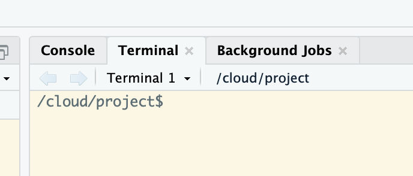

# Introduction

This is a very short introduction to some of the processes and tools we use when working in bioinformatics.

This is not meant to be anywhere near comprehensive; you will be shown a few of the fundamentals, and one walk-through of a single bioinformatics 'pipeline'.

One of the *main* differences between Bioinformatics and the data analysis you have done before is the **size** of the data. Bioinformatics usually deals with sequencing data, and this data has large file sizes.

Handling **big data** means you need to know how to operate on a supercomputer so we will be learning a little bit of Linux, processing **big** data into **small** data and then exporting into R to make some more amazing data visuals and interpret our findings!

This bookdown project is hosted here:

<https://github.com/dougwyu/6013A-Bioinformatics>

and is deployed here:

<https://dougwyu.github.io/6013A-Bioinformatics/index.html>

**DON'T** worry if you don't understand everything

**DO** ask lots of questions!

```{r include=FALSE}
library(tidyverse)
# automatically create a bib database for R packages
knitr::write_bib(c(
  .packages(), 'bookdown', 'knitr', 'rmarkdown'
), 'packages.bib')

knitr::opts_chunk$set(message=FALSE, warning=FALSE, eval=FALSE)
```

```{r klippy, echo=FALSE, eval=TRUE, include=TRUE}
klippy::klippy(c('r', 'bash'), position = c('top', 'right'), tooltip_message = 'copy to clipboard', tooltip_success = 'Copied!')
```

<!--chapter:end:index.Rmd-->

# Unix {#Unix}

```{r , echo=FALSE, eval=TRUE, include=TRUE}
klippy::klippy(c('r', 'bash'), position = c('top', 'right'), tooltip_message = 'copy to clipboard', tooltip_success = 'Copied!')
```

Unix is very likely the most fundamental skillset we can develop for bioinformatics (and much more than bioinformatics). Many of the most common and powerful bioinformatics approaches happen in this text-based environment, and having a solid foundation here can make everything we're trying to learn and do much easier. This is a short introductory tutorial to help us get from being completely new to Unix up to being friendly with it 🙂

## What is Unix/Linux?

UNIX is a computer operating system. It was first developed in 1969 at Bell Labs. Unix is written in the programming language `C`.

Unix is proprietary software, whereas Linux is *basically* free and open-source Unix.

The Linux Operating System is highly flexible, free, open-source (like R) and uses very little RAM to run (Unlike Windows OS) - as such you find most supercomputers run on Linux. Operationally Linux is almost identical to Unix, and so we often refer to it under the umbrella term of "unix-like" systems.

### Some terms

Here are some terms worth knowing, don't worry about memorising them, it can just be useful to have these to refer to in the future.

```{r, echo=FALSE, eval=TRUE}
terms <- readr::read_csv("data/terms-1.csv", skip_empty_rows = TRUE) 

knitr::kable(terms, booktabs = TRUE,
             col.names = c("Term", "What it is"),
             longtable=TRUE) %>%
  kableExtra::row_spec(0, bold = TRUE) %>%
  kableExtra::kable_styling()
```

> **Note**
>
> You should be familiar with using a GUI (Windows and macOS are GUIs), but to program a computer, you need to use a CLI (command line interface).

## Why Learn Unix?

Most sequencing data files are large and require a lot of computer memory (RAM) to process. As a result most of the work that bioinformaticians do is not hosted on their own laptops or desktops. Instead, they "remote-connect" to high performance supercomputers or cluster computers. Almost all of these high performance computers use "Unix-like" operatings systems, the most common of which is Linux.

As stated above, Linux is free and open-source so lots of developers. It's also well known for being stable, secure, reliable, and efficient.

Today, you will get some experience with using a Linux OS. By logging into posit.cloud you are connecting to a supercomputer that runs Linux, and on top of Linux, the company Posit make it possible to run RStudio, which is a GUI for the statistics program called R. (Confusing? Yes. Linux is a CLI on which the GUI RStudio runs, so that it is easier to run the CLI R.)

When you click on the RStudio's Terminal tab, it provides direct access to a command-line where we can execute commands and functions directly in Linux. (yes, now you have gone from the Linux CLI to RStudio's GUI back to the Linux CLI).

This allows us to start using programs other than R, and potentially use multiple programs & programming languages to work together.

> **Note**
>
> This series of practicals is designed for you to have a first introduction to Bioinformatics. It's about **exposure**, not memorising or mastering anything. Don't worry about the details!

## Getting started

Before we get started we need a terminal to work in.

-   Open the Bioinformatics RStudio Cloud Project in the BIO-6013A workspace
-   Click on the `Terminal` tab next to `Console` in the bottom-left pane of the RStudio GUI, this opens a command-line *Shell*

```{r, eval=TRUE,echo=FALSE, fig.cap='Here is an example of the Terminal tab, right next to the R console', out.width='80%', fig.asp=.75, fig.align='center'}

```

-   This is our "command line" where we will be typing all of our commands. We type our commands in a language called `bash`

-   The \$ is where you start typing from, left of this it tells you what folder you are currently in (`working directory`)

-   If you need to, you can exit the Terminal and start a new session easily with options in RStudio

## A few foundational rules

-   Spaces are special, spaces break things apart, as a rule it is therefore better to have functions and file names with dashes (-) or underscores (\_) - e.g. "draft_v3.txt" is preferred to "draft v3.txt".

-   The general syntax on the command line is: `command argument`. Again this is very similar to R except we don't use brackets e.g. in R we are used to `command(argument)`

-   Arguments can be **optional** e.g. if their is a default argument you may not have to write anything. Some functions *require* that arguments are specified. Again this is just like R.

## Let's get started

We will perform a very simple function and get a flavour of the similarities and differences to working in `R`.

`date` is a command that prints out the date and time. Copy and paste this command into your terminal

```{bash}
    date
```

This prints out the date/time in UTC

More information on using the date function (here)[<https://www.geeksforgeeks.org/date-command-linux-examples/>]

We can also ask for the output for a particular timezone using the `TZ` function and `date`

```{bash}
    TZ=Europe/London date
```

Or we can ask the computer what the date will be next Tuesday...

```{bash}
    date --date="next tue"
```

### Downloading data

We will start by typing in an instruction to download data from an online data repository, unpack the contents and inspect it:

-   `curl` is a command line tool for transferring data to and from a remote computer server. Here we will use this to download data from an online repository.

-   `tar` will *unpack* the data from a compressed file format

-   `cd` changes the directory so we *land* in the new folder we have made

```{bash}
    curl -L -o unix_intro.tar.gz https://ndownloader.figshare.com/files/15573746
    tar -xzvf unix_intro.tar.gz && rm unix_intro.tar.gz
    cd unix_intro
```

```{block, type="rmdwarning"}

Check each command line has run, in the example above you might find that the first two lines run, to download and unpack data, while the last line to change directory doesn't run until you hit enter

```

### More functions

Unlike date, most commands require arguments and won't work without them. `head` is a command that prints the first lines of a file, so it requires us to provide the file we want it to act on:

```{bash}
    head example.txt
```

Here "example.txt" is the required argument, and in this case it is also what's known as a positional argument. Whether things need to be provided as positional arguments or not depends on how the command or program we are using was written.

Sometimes we need to specify the input file by putting something in front of it (e.g. some commands will use the -i flag, but it's often other things as well).

<details>

<summary>**Q. What's in the text file? - Click here for Answer**</summary>

*Pretty boring, each line contains the text "This is line" followed by the line number e.g.*

*- This is line 1*

*- This is line 2*

*etc.*

</details>

There are also optional arguments for the head command. The default for head is to print the first 10 lines of a file. We can change that by specifying the -n flag, followed by how many lines we want:

```{bash}
    head -n 5 example.txt
```

How would we know we needed the -n flag for that? There are a few ways to find out. Many standard Unix commands and other programs will have built-in help menus that we can access by providing --help as the only argument:

```{bash}
    head --help
```

Again this is very similar to the logic in which R commands are structured e.g. `??ggplot()` The syntax is similar even if the specific icons or arguments are different.

Remember just like with R, one of your best friends is Google! As you get familiar with any language or OS we might remember a few flags or specific options, but searching for options and details when needed is definitely the norm!

## Unix File Structure

There are two special locations in all Unix-based systems: the "root" location and the current user's "home" location. "Root" is where the address system of the computer starts; "home" is usually where the current user's location starts.

Just to be awkward RStudio Cloud actually has us working in a different location "Cloud", which is underneath Root but separate to home which would be in the "Users" folder.

```{r, eval=TRUE,echo=FALSE, out.width='80%', fig.asp=.75, fig.align='center'}
knitr::include_graphics("images/file_system_structure.png")
```

We tell the command line where files and directories are located by providing their address, their "path". If we use the `pwd` command (for print working directory), we can find out what the path is for the directory we are sitting in.

```{bash}
    pwd
```

And if we use the `ls` command (for list), we can see what directories and files are in the current directory we are sitting in.

```{bash}
    ls
```

> **Note**
>
> Why is it important to know this? Usually when you are working on a Unix-like environment there is no GUI (nice-click and point interface), and all commands have to be submitted through the terminal. So you would have to get used to navigating directories with typed commands, and it's useful to know what the standard hierarchy is.

## Absolute vs relative file paths

You should be used to these concepts from your work with R projects.

There are two ways to specify the path (address) of the file we want to do something to:

-   An **absolute path** is an address that starts from an explicitly specified location: usually the "root" `/` or the "home" `~/` location. (Side note, because we also may see or hear the term, the "full path", is usually the absolute path that starts from the "root" /.)

-   A **relative path** is an address that starts from wherever we are currently sitting (the working directory). For example, let's look again at the head command we ran above:

```{bash}
    head example.txt
```

What we are actually doing here is using a relative path to specify where the "example.txt" file is located. This is because the command line **automatically looks** in the current working directory if we don't specify anything else about its location.

We can also run the same command on the same file using an **absolute path** - note Rstudio cloud has a slightly unique set-up in that we start from a folder designated cloud:

```{bash}
    head /cloud/project/unix_intro/example.txt
```

The previous two commands both point to the same file right now. But the first way, head example.txt, will only work if we are entering it while "sitting" in the directory that holds that file, while the second way will work no matter where we happen to be in the computer.

It is **important to always think about where** we are in the computer when working at the command line. One of the most common errors/easiest mistakes to make is trying to do something to a file that isn't where we think it is. Let's run head on the "example.txt" file again, and then let's try it on another file: "notes.txt":

```{bash}
head example.txt
```

```{bash}
head notes.txt
```

Here the head command works fine on "example.txt", but we get an error message when we call it on "notes.txt" telling us no such file or directory. If we run the `ls` command to list the contents of the current working directory, we can see the computer is absolutely right -- spoiler alert: it usually is -- and there is no file here named "notes.txt".

The ls command by default operates on the current working directory if we don't specify any location, but we can tell it to list the contents of a different directory by providing it as a positional argument:

```{bash}
    ls
```

```{bash}
    ls experiment
```

We can see the file we were looking for is located in the subdirectory called "experiment". Here is how we can run head on "notes.txt" by specifying an accurate relative path to that file:

```{bash}
    head experiment/notes.txt
```

## Moving around

We can also move into the directory containing the file we want to work with by using the `cd` command (**c**hange **d**irectory). This command takes a positional argument that is the path (address) of the directory we want to change into. This can be a relative path or an absolute path. Here we'll use the relative path of the subdirectory, "experiment", to change into it

```{bash}
    cd experiment/
```

```{bash}
    pwd
```

```{bash}
    ls
```

```{bash}
    head notes.txt
```

Great. But now how do we get **back "up"** to the directory above us? One way would be to provide an absolute path, like `cd /cloud/project/unix_intro`, but there is also a handy shortcut. `..` which are special characters that act as a relative path specifying "up" one level -- one directory -- from wherever we currently are.

So we can provide that as the positional argument to cd to get back to where we started:

```{bash}
    cd ..
```

Moving around the computer like this might feel a bit cumbersome and frustrating at first, but after spending a little time with it, you will get used to it, and it starts to feel more natural.

> **Note**
>
> One way to speed things up is to start using **tab** to perform **tab-completion** often this will auto-complete file names! Press tab twice quickly and it will print all possible combinations.

## Summary

While maybe not all that exciting, these things really are the foundation needed to start utilizing the command line -- which then gives us the capability to use lots of tools that only work at a command line, manipulate large files rapidly, access and work with remote computers, and more! These are the fundamental tools that every scientist needs to work with **big data**.

### Terms

```{r, echo=FALSE, eval=TRUE}
terms <- readr::read_csv("data/terms.csv", skip_empty_rows = TRUE) 

knitr::kable(terms, booktabs = TRUE,
             col.names = c("Term", "What it is"),
             longtable=TRUE) %>%
  kableExtra::row_spec(0, bold = TRUE) %>%
  kableExtra::kable_styling()
```

### Commands

```{r, echo=FALSE, eval=TRUE}
terms <- readr::read_csv("data/commands.csv", skip_empty_rows = TRUE) 

knitr::kable(terms, booktabs = TRUE,
             col.names = c("Command", "What it is"),
             longtable=TRUE) %>%
  kableExtra::row_spec(0, bold = TRUE) %>%
  kableExtra::kable_styling()
```

### Special characters

```{r, echo=FALSE, eval=TRUE}
terms <- readr::read_csv("data/characters.csv", skip_empty_rows = TRUE) 

knitr::kable(terms, booktabs = TRUE,
             col.names = c("Command", "What it is"),
             longtable=TRUE) %>%
  kableExtra::row_spec(0, bold = TRUE) %>%
  kableExtra::kable_styling()
```

## Summary

You won't get used to operating in bash, or moving around directories using just the command line in a single session. So if you think you are interested in developing your bioinformatic skills, spend some time practising.

Here is a link to a couple of extended tutorials you can bookmark if you want to explore this further:

<https://datacarpentry.org/shell-genomics/01-introduction/index.html>

## Stretch yourself - optional extras to try a couple of other skills

### Creation

I want to create a new directory to store some code files I'm going to write later, so I'll use `mkdir` to create a new directory called Code:

<details>

<summary>**Check you are in the `unix_intro` folder - Click here for Answer**</summary>

```{bash}
pwd
```

</details>

<details>

<summary>**Make a new directory called Code - Click here for Answer**</summary>

```{bash}
mkdir Code
```

</details>

<details>

<summary>**Check this folder has been created using a list function**</summary>

```{bash}
ls
```

</details>

Note that I used a relative file path to create the Code directory - but I could have also specified an absolute filepath to generate that folder in whatever location I want.

There are a few ways to make new files on the command line. The simplest is to generate a blank file with the `touch` command followed by the path (relative or absolute) to the file you want to create

<details>

<summary>**Make a new file called data-science-class.txt - Click here for Answer**</summary>

```{bash}
touch data-science-class.txt
ls -l
```

*Note here I could just use ls to list all files and folders in a directory, but if i set the flag `-l` then it will produce a **l**ong list of files.*

*If the entry in the first column is a `d`, then the row in the table corresponds to a directory, otherwise the information in the row corresponds to a file.*

*The string of characters following the `d` in the case of a directory or following the first `-` in the case of a file represent the permissions for that file or directory - I won't cover that here - but some of the links I provide go into more detail.*

</details>

<!--chapter:end:01-intro.Rmd-->

# NGS sequence analysis
```{r , echo=FALSE, eval=TRUE, include=TRUE}
klippy::klippy(c('r', 'bash'), position = c('top', 'right'), tooltip_message = 'copy to clipboard', tooltip_success = 'Copied!')
```
## Background on high throughput sequencing

High-throughput sequencing, also known as massively parallel sequencing or next-generation sequencing (NGS), is a collection of methods and technologies that can sequence DNA thousands/millions of fragments at a time. The market leader on NGS is Illumina, and an overview of their technology is in the video below.

<iframe width="560" height="315" src="https://www.youtube.com/embed/fCd6B5HRaZ8" title="YouTube video player" frameborder="0" allow="accelerometer; autoplay; clipboard-write; encrypted-media; gyroscope; picture-in-picture" allowfullscreen></iframe>

There are many uses for high throughput sequencing including:

- Whole genome sequencing

- Amplicon sequencing - PCR of a targeted gene(s) is step one
    - environmental DNA
    - 16S Bacterial community analysis
    - Targeted gene panels
    
- RNA sequencing

- ChIP sequencing: Protein-DNA interaction analysis

Importantly a **lot** of the basic bioinformatics is the same across these technologies, because the data that is produced from the sequencing run is basically the same as well. The *big* data generated here are all massive *FASTQ* files, processing these follows basically the same initial pipeline for all applications. 

## Some terms
```{r,  echo=FALSE, eval=TRUE}
terms <- read_csv("data/sequencing.csv", skip_empty_rows = TRUE) 

knitr::kable(terms, booktabs = TRUE,
             col.names = c("Term", "What it is"),
             longtable=TRUE) %>%
  kableExtra::row_spec(0, bold = TRUE) %>%
  kableExtra::kable_styling()
```

## The data

This data comes from exploring an underwater mountain \~3 km down at the bottom of the Pacific Ocean that serves as a low-temperature (\~5-10°C) hydrothermal venting site. 

This amplicon dataset was generated from DNA extracted from crushed basalts collected from across the mountain with the goal being to begin characterizing the microbial communities of these deep-sea rocks. No one had ever been here before, so this was a broad-level community survey. The sequencing was done on the Illumina MiSeq platform with 2x300 paired-end sequencing using primers targeting the V4 region of the 16S rRNA gene. 

There are 20 samples total: 4 extraction "blanks" (nothing added to DNA extraction kit), 2 bottom-water samples, 13 rocks, and one biofilm scraped off of a rock. None of these details are important for you to remember, it's just to give some overview if you care.

<details><summary>**Q. Why would we include "blank" samples in our sequencing run? - Click here for Answer**</summary>

*This sort of "environmental data" is very at risk of contamination, although the DNA extractions, and PCRs have to be run under sterile conditions or they will pick up bacteria from the lab and not the sample. Despite our best efforts we can still get minor contamination, these "blank" runs can be useful as anything in these samples* **cannot** *have come from our deep-sea rocks, and therefore we could choose to "remove" sequences that match these in our other samples and label them as contamination.*

</details>

In the following figure, overlain on the map are the rock sample collection locations, and the panes on the right show examples of the 3 distinct types of rocks collected: 1) basalts with highly altered, thick outer rinds (\>1 cm); 2) basalts that were smooth, glassy, thin exteriors (\~1-2 mm); and 3) one calcified carbonate.

```{r, eval=TRUE,echo=FALSE,  nice-fig, fig.cap='Map of collection sites and examples of the rocks collected', out.width='80%', fig.asp=.75, fig.align='center'}
knitr::include_graphics("images/samples.png")
```


Altogether the uncompressed size of the working directory we are downloading here is \~300MB - this is about 10% of the full dataset - we are using a reduced dataset to minimise system requirements and speed up the workflow.

To get started, be sure you are in the "Terminal" window. We will be working here for the first step of importing the data, and removing the primers from our data. We can import our data using the `curl` function, we will then remove the primers using a program called `cutadapt` which is written in Python.

Make sure when you open the terminal you are in the project directory (and refer to last weeks notes if you need to check how to do this).

Don't switch over to R (the "Console" tab in the Binder/RStudio environment) until noted. You can download the required dataset and files by copying and pasting the following commands into your command-line terminal:

```{bash}
    curl -L -o dada2_amplicon_ex_workflow.tar.gz https://ndownloader.figshare.com/files/23066516
    tar -xzvf dada2_amplicon_ex_workflow.tar.gz
    rm dada2_amplicon_ex_workflow.tar.gz
    cd dada2_amplicon_ex_workflow/
```

<details><summary>**Q. Can you work out what each of these lines of code might be doing? - Click here for Answer**</summary>

*In brief these commmands:*

*- download/curl some external data*
*- uncompress into a folder*
*- remove the compressed file*
*- change the working directory to the newly created folder*

</details>


In our working directory there are now 20 samples with one forward (R1) and one reverse (R2) read each, each file has DNA sequences with per-base-call quality information, for a total of 40 fastq files (.fq). It is a good idea to have a file with all the sample names to use for various things throughout, so here's making that file based on how these sample names are formatted.

```{bash}
    ls *_R1.fq | cut -f1 -d "_" > samples
```

### FASTQ?

FASTQ format is a text-based format for storing both a biological sequence (usually nucleotide sequence) and its corresponding quality scores. As each nucleotide in a *read* is sequenced, it is assigned a *Phred quality score*. This score is the assigned *probability* of the sequencer having made an incorrect base call

```{r,  echo=FALSE, eval=TRUE}
terms <- read_csv("data/phred.csv", skip_empty_rows = TRUE) 

knitr::kable(terms, booktabs = TRUE,
             col.names = c("Phred Quality Score", "Probability of incorrect base call", "Base call accuracy"),
             longtable=TRUE) %>%
  kableExtra::row_spec(0, bold = TRUE) %>%
  kableExtra::kable_styling()
```

These quality scores are stored within the FASTQ files as ASCII characters


```{r, eval=TRUE,echo=FALSE, , fig.cap='Phred quality scores as ASCII characters', out.width='80%', fig.asp=.75, fig.align='center'}
knitr::include_graphics("images/ascii.png")
```

This is all stored together as four simple lines of repeating text so that a FASTQ file containing a single sequence might look like this:

```{}
@SEQ_ID
GATTTGGGGTTCAAAGCAGTATCGATCAAATAGTAAATCCATTTGTTCAACTCACAGTTT
+
!''*((((***+))%%%++)(%%%%).1***-+*''))**55CCF>>>>>>CCCCCCC65

```


A single FASTQ file may contain millions of sequencing reads. Let's look at the first 40 lines of *one* of our FASTQ files. And check it looks like a standard format. 

```{bash}
head -40 B1_sub_F1.fq
```

<details><summary>**Q. By eye, can you tell whether these few lines look to be of good quality? - Click here for Answer**</summary>

*The ASCII characters are repeated every fourth line, most of these reads appear to be G letters or close to this - indicating greater than 99.9% accuracy - pretty good. Very observant students might have noticed that the end of the reads appear to be of lower quality. More on this later*

</details>

## The Pipeline

This is a very simple overview of the pipeline we will run, some of these steps (especially early ones - are applicable to lots of NGS applications), later on they become more specific to *our* data.

- Import the FASTQ files and demultiplex (this step was done for us)

- Remove adapters and primers (these may be included with our reads, but they are not part of the *natural* DNA sequence)

- Check FASTQ data quality and trim/filter reads accordingly

- Dereplicate (collapse identical sequences and choose a representative)

- Assign ASVs - decide if (non-identical) sequences are similar enough to be considered as from the same species

- Join forward and reverse reads together

- Assign ASVs to Taxonomies

- Count the abundance of different ASVs

- Export taxonomy file, ASV fasta sequence file and count file to R for analysis


## Removing Primers

To start, we need to remove the primers from all of these (the primers used for this run are in the "primers.fa" file in our working directory), and here we're going to use `cutadapt` to do that at the command line ("Terminal" tab).

First we need to install `cutadapt`

```{bash}
python3 -m pip install --user --upgrade cutadapt
```

>**Note**
>
>You will probably get a warning message about PATH. You can ignore this, what it means is that CUTADAPT has been installed in your home directory, in order to use it we need to specify the absolute path TO cutadapt when we call it. This is done for you in the next code box below. 

Cutadapt operates on one sample at at time, so we're going to use a wonderful little bash *loop* to run it on all of our samples.

### Loops

Loops are extremely powerful way of controlling iteration. We can specify that a line of code is repeated across multiple objects. In this example we use the `samples` file we made earlier as the list of files across which we want this function of removing primers to loop. These same lines will then repeat until all the specified iterations are complete.

We won't break down exactly how this loop works - but they are used across all programming languages (including R) and you can check out the R4DS book for an introduction to building your own loops (and custom functions!) [here](https://r4ds.had.co.nz/iteration.html).

For now just copy and paste this code exactly into the Terminal.
```{bash}
    for sample in $(cat samples)
    do

        echo "On sample: $sample"
        
        ~/.local/bin/cutadapt -a ^GTGCCAGCMGCCGCGGTAA...ATTAGAWACCCBDGTAGTCC \
        -A ^GGACTACHVGGGTWTCTAAT...TTACCGCGGCKGCTGGCAC \
        -m 215 -M 285 --discard-untrimmed \
        -o ${sample}_sub_R1_trimmed.fq.gz -p ${sample}_sub_R2_trimmed.fq.gz \
        ${sample}_sub_R1.fq ${sample}_sub_R2.fq \
        >> cutadapt_primer_trimming_stats.txt 2>&1

    done
```

Here's a before-and-after of one of our files - if you look at the sequences supplied: GTGCCAGCMGCCGCGGTAA...ATTAGAWACCCBDGTAGTCC these indicate the forward primer and the reverse primer (our amplicon is everything inbetween). If you look at our before and after you should see these were at the start and end of the sequence but have now been trimmed off. 

    ### R1 BEFORE TRIMMING PRIMERS
    head -n 2 B1_sub_R1.fq
    # @M02542:42:000000000-ABVHU:1:1101:8823:2303 1:N:0:3
    # GTGCCAGCAGCCGCGGTAATACGTAGGGTGCGAGCGTTAATCGGAATTACTGGGCGTAAAGCGTGCGCAGGCGGTCTTGT
    # AAGACAGAGGTGAAATCCCTGGGCTCAACCTAGGAATGGCCTTTGTGACTGCAAGGCTGGAGTGCGGCAGAGGGGGATGG
    # AATTCCGCGTGTAGCAGTGAAATGCGTAGATATGCGGAGGAACACCGATGGCGAAGGCAGTCCCCTGGGCCTGCACTGAC
    # GCTCATGCACGAAAGCGTGGGGAGCAAACAGGATTAGATACCCGGGTAGTCC

    ### R1 AFTER TRIMMING PRIMERS
    head -n 2 B1_sub_R1_trimmed.fq
    # @M02542:42:000000000-ABVHU:1:1101:8823:2303 1:N:0:3
    # TACGTAGGGTGCGAGCGTTAATCGGAATTACTGGGCGTAAAGCGTGCGCAGGCGGTCTTGTAAGACAGAGGTGAAATCCC
    # TGGGCTCAACCTAGGAATGGCCTTTGTGACTGCAAGGCTGGAGTGCGGCAGAGGGGGATGGAATTCCGCGTGTAGCAGTG
    # AAATGCGTAGATATGCGGAGGAACACCGATGGCGAAGGCAGTCCCCTGGGCCTGCACTGACGCTCATGCACGAAAGCGTG
    # GGGAGCAAACAGG


You can look through the output of the cutadapt stats file we made ("cutadapt_primer_trimming_stats.txt") to get an idea of how things went. 

Here's a little one-liner to look at what fraction of reads were retained in each sample (column 2) and what fraction of bps were retained in each sample (column 3):
```{bash}
    paste samples <(grep "passing" cutadapt_primer_trimming_stats.txt | cut -f3 -d "(" | tr -d ")") <(grep "filtered" cutadapt_primer_trimming_stats.txt | cut -f3 -d "(" | tr -d ")")
```

    # B1    96.5%   83.0%
    # B2    96.6%   83.3%
    # B3    95.4%   82.4%
    # B4    96.8%   83.4%
    # BW1   96.4%   83.0%
    # BW2   94.6%   81.6%
    # R10   92.4%   79.8%
    # R11BF 90.6%   78.2%
    # R11   93.3%   80.6%
    # R12   94.3%   81.4%
    # R1A   93.3%   80.5%
    # R1B   94.0%   81.1%
    # R2    94.0%   81.2%
    # R3    93.8%   81.0%
    # R4    95.5%   82.4%
    # R5    93.7%   80.9%
    # R6    92.7%   80.1%
    # R7    94.4%   81.5%
    # R8    93.2%   80.4%
    # R9    92.4%   79.7%

This looks like it worked pretty well! 
Some reads were discarded entirely `-m 215 -M 285 --discard-untrimmed \` anything <215bp or >285bp was discarded. Looks like c. 6-8%
We lost a greater proportion of bp overall, but this is the program working as it should, making most of our reads a little shorter as it cuts off the primers. Overall it looks like we lost c.20% of bp.

Importantly all of our files have behaved *roughly* the same. 

With primers removed, we're now ready to switch R and start using DADA2!

## DADA2

```{block, type="rmdwarning"}

Switch from the Terminal to Console now.
We are working in R for the rest of this workflow

```

```{r}
    library(dada2)


    setwd("dada2_amplicon_ex_workflow")

    list.files() # make sure what we think is here is actually here

    ## first we're setting a few R objects we're going to use ##
      # one with all sample names, by scanning our "samples" file we made earlier
  samples <- scan("samples", what="character")

      # one holding the file names of all the forward reads
  forward_reads <- paste0(samples, "_sub_R1_trimmed.fq.gz")

      # and one with the reverse
  reverse_reads <- paste0(samples, "_sub_R2_trimmed.fq.gz")

      # and variables holding file names for the forward and reverse
      # filtered reads we're going to generate below
  filtered_forward_reads <- paste0(samples, "_sub_R1_filtered.fq.gz")
  filtered_reverse_reads <- paste0(samples, "_sub_R2_filtered.fq.gz")
  
```

## Quality trimming/filtering

We did a filtering step above with cutadapt (where we eliminated reads that had imperfect or missing primers and those that were shorter than 215 bps or longer than 285), but in DADA2 we'll implement a trimming step as well (where we trim reads down based on some quality threshold rather than throwing the read away). 

Since we're potentially shortening reads further, we're again going to include another minimum-length filtering component. We can also take advantage of a handy quality plotting function that DADA2 provides to visualize how you're reads are doing, plotQualityProfile(). 

By running that on our variables that hold all of our forward and reverse read filenames, we can easily generate plots for all samples or for a subset of them. So let's take a peak at that to help decide our trimming lengths: It's good to try to keep a bird's-eye view of what's going on. So here is an overview of the main processing steps we'll be performing with cutadapt and DADA2. Don't worry if anything seems unclear right now, we will discuss each at each step.

```{r}
    plotQualityProfile(forward_reads[17:20])

    plotQualityProfile(reverse_reads[17:20])
```

All forwards look pretty similar to each other, and all reverses look pretty similar to each other, but worse than the forwards, which is common --
the Illumina sequencer reads all of the molecules in the forward orientation *first*, then the clusters are flipped and read in reverse. But this means a lot of the chemical reagents start to get used up or degraded, so it is usual to get lower quality reverse reads. 

On the plots produced

-   the x axis is the nucleotide bases starting from the beginning of the read moving to the end

-   the y axis is the average quality score for the base in that position

-   the green line is the median quality score of the base at that position

-   the orange lines are quartiles

These quality profiles are based entirely on taking the *average* PHRED scores for sequences at that position in the sample

Here, I'm going to cut the forward reads at 250 and the reverse reads at 200 -- roughly where both sets maintain a median quality of 30 or above -- and then see how things look. But we also want to set a minimum length to filter out truncated sequences, so we will set a minimum acceptable read length of 175bp (any reads shorter than this will be discarded).

In DADA2, this quality-filtering step is done with the `filterAndTrim()` function:
```{r}

    filtered_out <- filterAndTrim(forward_reads, filtered_forward_reads,
                    reverse_reads, filtered_reverse_reads, maxEE=c(2,2),
                    rm.phix=TRUE, minLen=175, truncLen=c(250,200))
```
This function made a bunch of output files "filtered_forward_reads" and "filtered_reverse_reads" we can see these in our project pane. Or if we were working on a server without a GUI we could use `list.files()` in R or `ls` in our Terminal.

We also generated an R file called filtered_out. This is a simple matrix holding how many reads went *in* for each file and how many came *out*.

Check it in R.
```{r}
    filtered_out
```
We can take a look at the filtered reads visually - we expect to have trimmed off that section where quality drops
```{r}
    plotQualityProfile(filtered_reverse_reads[17:20])
```

Looking Good!

## Dereplication

Dereplication is a common step in many amplicon processing workflows. Instead of keeping 100 identical sequences and doing all downstream processing to all 100 -costing computer processing power and time, you can keep/process just one of them, and just attach the number x100 to it. Now this acts as a representative for 100 identical sequences. 

```{r}
derep_forward <- derepFastq(filtered_forward_reads, verbose=TRUE)
names(derep_forward) <- samples # the sample names in these objects are initially the file names of the samples, this sets them to the sample names for the rest of the workflow
derep_reverse <- derepFastq(filtered_reverse_reads, verbose=TRUE)
names(derep_reverse) <- samples
```

## ASV's

This is where we start to take our raw sequence data and infer *true* biological sequences. 
It uses an algorithm to look at the consensus quality score and abundance for each *unique* sequence. It then determines whether this sequence is more likely to be of biological origin or a spurious sequencing error. 

>**Note**
>
>This step may take a few minutes to run, so be patient! 


```{r}
load("amplicon_dada2_ex.RData")

dada_forward <- dada(derep_forward, err=err_forward_reads, pool="pseudo")

dada_reverse <- dada(derep_reverse, err=err_reverse_reads, pool="pseudo")


```

## Merging reads

Now DADA2 merges the forward and reverse ASVs to reconstruct our full target amplicon requiring the overlapping region to be identical between the two. By default it requires that at least 12 bps overlap, but in our case the overlap should be much greater. If you remember above we trimmed the forward reads to 250 and the reverse to 200, and our primers were 515f–806r. After cutting off the primers we’re expecting a typical amplicon size of around 260 bases, so our typical overlap should be up around 190. That’s estimated based on E. coli 16S rRNA gene positions and very back-of-the-envelope-esque of course, so to allow for true biological variation and such I’m going ot set the minimum overlap for this dataset for 170. I’m also setting the trimOverhang option to TRUE in case any of our reads go passed their opposite primers (which I wouldn’t expect based on our trimming, but is possible due to the region and sequencing method).

```{r}
merged_amplicons <- mergePairs(dada_forward, derep_forward, dada_reverse,
                    derep_reverse, trimOverhang=TRUE, minOverlap=170)

  # this object holds a lot of information that may be the first place you'd want to look if you want to start poking under the hood
class(merged_amplicons) # list
length(merged_amplicons) # 20 elements in this list, one for each of our samples
names(merged_amplicons) # the names() function gives us the name of each element of the list 

class(merged_amplicons$B1) # each element of the list is a dataframe that can be accessed and manipulated like any ordinary dataframe

names(merged_amplicons$B1) # the names() function on a dataframe gives you the column names
# "sequence"  "abundance" "forward"   "reverse"   "nmatch"    "nmismatch" "nindel"    "prefer"    "accept"
```

## Count table
Now we can generate a count table with the makeSequenceTable() function. This is one of the main outputs from processing an amplicon dataset. You may have also heard this referred to as a biome table, or an OTU matrix.

```{r}
seqtab <- makeSequenceTable(merged_amplicons)
class(seqtab) # matrix
dim(seqtab) # 20 2521

```

## Overview

The developers’ DADA2 tutorial provides an example of a nice, quick way to pull out how many reads were dropped at various points of the pipeline. This can serve as a jumping off point if you’re left with too few sequences at the end to help point you towards where you should start digging into where they are being dropped. Here’s a slightly modified version:

```{r}
  # set a little function
getN <- function(x) sum(getUniques(x))

  # making a little table
summary_tab <- data.frame(row.names=samples, dada2_input=filtered_out[,1],
               filtered=filtered_out[,2], dada_f=sapply(dada_forward, getN),
               dada_r=sapply(dada_reverse, getN), merged=sapply(merged_amplicons, getN),
               nonchim=rowSums(seqtab.nochim),
               final_perc_reads_retained=round(rowSums(seqtab.nochim)/filtered_out[,1]*100, 1))

summary_tab

```

And it might be useful to write this table out of R, saving it as a regular file

```{r}
write.table(summary_tab, "read-count-tracking.tsv", quote=FALSE, sep="\t", col.names=NA)
```

## Assign taxonomy

```{block, type="rmdwarning"}

Running the Taxonomy assignment step below can take anywhere from 30 minutes to a few hours depending on how much RAM we provide.
So for this example run - we will skip this step and load an R.data file which has this information in it already

```

```{r}
load("amplicon_dada2_ex.RData")
```

<details><summary>**Example code for running taxonomy assignment - Click here**</summary>

*So we won't run this code in this example, but here it is for reference.* 


```{}
## downloading DECIPHER-formatted SILVA v138 reference
download.file(url="http://www2.decipher.codes/Classification/TrainingSets/SILVA_SSU_r138_2019.RData", destfile="SILVA_SSU_r138_2019.RData")

## loading reference taxonomy object
load("SILVA_SSU_r138_2019.RData")

## loading DECIPHER
library(DECIPHER)

## creating DNAStringSet object of our ASVs
dna <- DNAStringSet(getSequences(seqtab.nochim))

## and classifying
tax_info <- IdTaxa(test=dna, trainingSet=trainingSet, strand="both", processors=NULL)
```

</details>

## Standard goods

The typical standard outputs from amplicon processing are 

- a fasta file: each ASV represented by a sequence `asv_fasta_no_contam`

- a count table: how many sequences of each ASV in each sample `asv_tab_no_contam`

- a taxonomy file: the closest biological species to the fasta sequence `asv_tax_no_contam`

These objects from DADA2 can then be analysed to start to understand the different bacterial communities from our deep-sea study:

>**Note**
>
>* These three files are relatively small simply lists now, you can type them into the R console and inspect these outputs if you wish. Do they make sense to you? 


```{r, include=FALSE}
  # giving our seq headers more manageable names (ASV_1, ASV_2...)
asv_seqs <- colnames(seqtab.nochim)
asv_headers <- vector(dim(seqtab.nochim)[2], mode="character")

for (i in 1:dim(seqtab.nochim)[2]) {
  asv_headers[i] <- paste(">ASV", i, sep="_")
}

  # making and writing out a fasta of our final ASV seqs:
asv_fasta <- c(rbind(asv_headers, asv_seqs))
write(asv_fasta, "ASVs.fa")

  # count table:
asv_tab <- t(seqtab.nochim)
row.names(asv_tab) <- sub(">", "", asv_headers)
write.table(asv_tab, "ASVs_counts.tsv", sep="\t", quote=F, col.names=NA)

  # tax table:
  # creating table of taxonomy and setting any that are unclassified as "NA"
ranks <- c("domain", "phylum", "class", "order", "family", "genus", "species")
asv_tax <- t(sapply(tax_info, function(x) {
  m <- match(ranks, x$rank)
  taxa <- x$taxon[m]
  taxa[startsWith(taxa, "unclassified_")] <- NA
  taxa
}))
colnames(asv_tax) <- ranks
rownames(asv_tax) <- gsub(pattern=">", replacement="", x=asv_headers)

write.table(asv_tax, "ASVs_taxonomy.tsv", sep = "\t", quote=F, col.names=NA)

```

## Functions list

```{r, echo=FALSE, eval=TRUE}
terms <- read_csv("data/dada.csv", skip_empty_rows = TRUE) 

knitr::kable(terms, booktabs = TRUE,
             col.names = c("Command", "What it is"),
             longtable=TRUE) %>%
  kableExtra::row_spec(0, bold = TRUE) %>%
  kableExtra::kable_styling()
```


## Summary

We have imported FASTQ data from an Illumina sequencing run, processed the files to remove poor quality reads and trim primers. We have then put this through a microbiome specific bioinformatics pipeline to assign millions of individual reads to more manageable representative sequences. We have assigned taxonomies to these sequences and tallied them, so that **next time** we can actually inspect our data and start to make visuals that describe our microbial communities. 

<!--chapter:end:02-literature.Rmd-->


# Introduction to Statistical Analysis of the microbiome data

```{r, eval=TRUE}
library(phyloseq)
library(tidyverse)
library(gt)
```

```{r, echo=FALSE, eval=TRUE, include=TRUE}
klippy::klippy(c('r', 'bash'), position = c('top', 'right'), tooltip_message = 'copy to clipboard', tooltip_success = 'Copied')
```

This section provides a quick introduction to some common analytic methods used to analyze microbiome data. 
In previous sections we worked with microbiome generated data, but ran through some fairly standard protocols that would apply to any Illumina-seq generated data and FASTQ files.

Now we are at the visualisation and statistical analysis phase - and we should start to see the implementation of some very familiar R tools.

Briefly today we will use R to understand more about

- Describing the microbial community composition of a set of samples

- Estimating within- and between-sample diversity

- Identifying differentially abundant taxa


## Important files

We're mostly going to be working with just 3 files now.

- A count table: the number of reads for each unique sequence

- A taxonomy table: the assigned taxonomy for each sequence according to the SILVA database

- A sample file: this is the "metadata" it contains any information *we* have provided about the different samples


If you worked through the entirety of the previous session you will already have the necessary R objects in your workspace. If you didn't we can load them using a `.RData` file. You should see that your Environment is suddenly populated by a number of R objects.

```{r, include=FALSE, eval=TRUE}
load(file="amplicon_dada2_ex.RData")

```

The one thing missing that we also need to load is a sample info object (it tells us meta-data about the origins and conditions of each environmental sample.)


```{r, eval=TRUE}
sample_info_tab <- read.table("sample_info.tsv", header=T, row.names=1,
                   check.names=F, sep="\t")

```


## Phyloseq

Microbiome community analysis works really well with a package called `phyloseq` it allows you to make special R objects that hold the distinct sets of information on ASV abundance, taxonomy and relation to the environmental samples in one R object.

```{r, eval=TRUE}
ps <- phyloseq(otu_table(asv_tab_no_contam, taxa_are_rows=T), 
               sample_data(sample_info_tab), 
               tax_table(asv_tax_no_contam))
ps
```

> **Note**
>
> Since we’ve already used decontam to remove likely contaminants in the previous steps, we’re dropping the “blank” samples from our count table - so now there are 16 samples total. 


<details><summary>**Take a look at each of the three objects: asv_tab_no_contam, sample_data, tax_table. There are just simple lists - can you comfortably work out the information they contain?**</summary>

- `asv_tab_no_contam` A count table: the number of reads for each unique sequence

- `asv_tax_no_contam` A taxonomy table: the assigned taxonomy for each sequence according to the [SILVA](https://www.arb-silva.de/) database

- `sample_info_tab` A sample file: this is the "metadata" it contains any information *we* have provided about the different samples

</details>


## Relative abundance of bacteria by taxonomic Class

We will use some functions provided by `phyloseq` to agglomerate the reads to Class-level and plot the results

```{r, eval=TRUE}
taxonomy <- ps %>% 
  tax_glom(taxrank="class") %>% ### Preserves taxonomy only to Taxonomic level class
  transform_sample_counts(function(x){x/sum(x)})%>% ### this function turns Abundance from raw counts to a relative proportion
  psmelt() %>% ###converts phyloseq object into a tibble 
  filter(Abundance >0.05) ### remove any ASVs at less than 5% abundance

```


Often an early step in many microbiome projects to visualize the relative abundance of organisms at specific taxonomic ranks. 

```{r, eval=TRUE}
taxonomy %>% 
  ggplot(aes(x=Sample, y=Abundance, fill=class))+
  geom_bar(stat="identity")

```
The ability to discriminate between more than say a dozen colors in a single plot is a limitation of the stacked bar plot - so we have filtered out less abundant reads (<5%). We run the risk that we might miss something important here, so its important to visualise the data in different ways. 


There are a total of 10 Bacterial classes (at greater than 5% abundance). 

Let's generate boxplots according to `char` and facet these according to Bacterial `class`. This will allow us to compare how different bacterial classes appear to change in relative abundance between samples. 

Try and produce something similar to the plot below

```{r, echo=FALSE, eval=TRUE}
taxonomy %>% 
  mutate(class=fct_reorder(class, Abundance)) %>% 
  ggplot(aes(x=class, y=Abundance))+
  geom_boxplot()+geom_jitter(aes(color=class), width=0.2)+
  facet_wrap(.~char)+
  theme_classic()+
  theme(axis.text.x=element_text(angle=45, hjust=1), legend.position="none")+
  labs(x="Bacterial class", y="Relative Abundance")
```


<div id="box">
<details><summary>**Need code?**
**Click here**</summary>

```{r, echo=TRUE, eval=FALSE}
taxonomy %>% 
  mutate(class=fct_reorder(class, Abundance)) %>% 
  ggplot(aes(x=class, y=Abundance))+
  geom_boxplot()+geom_jitter(aes(color=class), width=0.2)+
  facet_wrap(.~char)+
  theme_classic()+
  theme(axis.text.x=element_text(angle=45, hjust=1), legend.position="none")+
  labs(x="Bacterial class", y="Relative Abundance")
```

</details>
</div>


Think about what you can infer from these plots?

## Alpha diversity - community richness

This is a common ecological term, and one that applies just as well when we consider microbial ecosystems.

What is the mean species diversity in the different sample sites?

```{r, eval=FALSE}
ps_richness <- estimate_richness(ps)
ps_richness
```

```{r, echo=FALSE, eval=TRUE}
ps_richness <- estimate_richness(ps)

```

This command generates a number of different diversity indices. 
Firstly we can take this information and use `join` functions to attach it back onto our sample *metadata*

```{r, eval=FALSE}
sample_info_tab$Sample <- rownames(sample_info_tab)

ps_richness$Sample <- rownames(ps_richness)

full_richness <- left_join(sample_info_tab, ps_richness, "Sample")
full_richness 
```

```{r, echo=FALSE, eval=TRUE}
sample_info_tab$Sample <- rownames(sample_info_tab)

ps_richness$Sample <- rownames(ps_richness)

full_richness <- left_join(sample_info_tab, ps_richness, "Sample")
full_richness %>% 
  gt()
```


### Analyse and plot

We now have a tidy data frame with sample information and a variety of diversity indices. 

- Using the Shannon index as the measure of diversity - can you construct a figure to show the diversity differences between treatments?

- Again using the Shannon index - can you construct a `general linear model` to work out which treatments/effects might be having a significant effect on diversity?


## Beta diversity

### Heatmaps

Heatmaps are basically false colour images where cells in the matrix with high relative values are coloured differently from those with low relative values. Heatmaps can range from very simple blocks of colour with lists along 2 sides, or they can include information about hierarchical clustering, and/or values of other covariates of interest.

We will make a simple heatmap here, but a common addition might be a dendrogram - a phylogenetic tree to indicate how closely related different 

```{r, eval=TRUE}
ps_top20 <- prune_taxa(names(sort(taxa_sums(ps),TRUE)[1:20]), ps) ## subset to include only the top 20 most abundant ASVs

plot_heatmap(ps_top20,"MDS",distance = "bray", ## here we are setting up the parameters for the heat map
             sample.label="char", ## set the x axis to display by sample
             low="purple",   ## set the color for low abundance OTUs
             high="darkorange") ## set the color for high abundance OTUs

```


### Multidimensional analysis

Often in ecological research, we are interested not only in comparing univariate descriptors of communities, like diversity (above), but also in how the constituent species — or the composition — changes from one community to the next.

One common tool to do this is non-metric multidimensional scaling, or NMDS. The goal of NMDS is to collapse information from multiple dimensions (e.g, from multiple communities, sites, etc.) into just a few, so that they can be visualized and interpreted.

Consider a single axis representing the abundance of a single species. Along this axis, we can plot the communities in which this species appears, based on its abundance within each.

Now consider a second axis of abundance, representing another species. We can now plot each community along the two axes (Species 1 and Species 2).

Keep going and imagine how many axes we would have to produce!!!!

The goal of NMDS is to represent the original position of communities in multidimensional space as accurately as possible using a reduced number of dimensions that can be easily plotted and visualized (and to spare your thinker).

NMDS does not use the absolute abundances of species in communities, but rather their rank orders. The use of ranks omits some of the issues associated with using absolute distance (e.g., sensitivity to transformation), and as a result is a flexible technique


```{r, eval=TRUE}
    ### Ordination using built in functions in phyoseq (calls vegan)    
ord.nmds.bray <- ordinate(ps, method="NMDS",k=2, distance="bray")
```

You should see each iteration of the NMDS until a solution is reached (i.e., stress was minimized after some number of reconfigurations of the points in 2 dimensions). You can increase the number of default iterations using the argument trymax=. which may help alleviate issues of non-convergence. If high stress is your problem, increasing the number of dimensions to k=3 might also help.


Often in ecological research, we are interested not only in comparing univariate descriptors of communities, like diversity (above), but also in how the constituent species — or the composition — changes from one community to the next.

One common tool to do this is non-metric multidimensional scaling, or NMDS. The goal of NMDS is to collapse information from multiple dimensions (e.g, from multiple communities, sites, etc.) into just a few, so that they can be visualized and interpreted.

Consider a single axis representing the abundance of a single species. Along this axis, we can plot the communities in which this species appears, based on its abundance within each.

Now consider a second axis of abundance, representing another species. We can now plot each community along the two axes (Species 1 and Species 2).

Keep going and imagine how many axes we would have to produce!!!!

The goal of NMDS is to represent the original position of communities in multidimensional space as accurately as possible using a reduced number of dimensions that can be easily plotted and visualized (and to spare your thinker).

NMDS does not use the absolute abundances of species in communities, but rather their rank orders. The use of ranks omits some of the issues associated with using absolute distance (e.g., sensitivity to transformation), and as a result is a flexible technique


We can use the function plot.ordination to use our NMDS scaling to position our samples on a ggplot

```{r, eval=TRUE}
ord1<-plot_ordination(ps, ord.nmds.bray, color="char", title="Bray NMDS")
ord1
```


And we can add customisations to improve the plot

```{r, eval=TRUE, warning=FALSE, message=FALSE}
ord1 + stat_ellipse(type="norm",
                    geom="polygon",
                    aes(fill=char),
                    alpha=0.3,
                    linetype="dashed") +
     geom_point(pch=21, aes(fill=char), colour="white", stroke=0.5, size=3)+
        theme_classic()
```


## Question

We have now produced several different visualisations and analyses of the microbiome communities from these deep sea samples. 
What do you think are the most important or interesting findings here?


## Summary

This is a *very* brief introduction to using **big** data. Hopefully you can see that many of the command line tools, data cleaning and analysis and visualisation you have been practising prepare you for Big Data Biology.

In this example, in order to have generated and processed this data, you would have needed to know 

- Sampling techniques
- Molecular lab skills
- Data analysis and coding knowledge
- Ecological skills (community analysis)

Biology is increasingly interdisciplinary - and the skills you learn in one module should be transferable to other things you do. 

And remember at the heart of everything is Data! It doesn't matter what you are studying or why - good data skills are fundamental.

Thank you! 

<!--chapter:end:03-method.Rmd-->

# Exercises in understanding


## Exercise one

### Critical analysis of a figure

Choose one figure you have made from the exercises and answer the following questions:

- Why was this figure drawn? What research question does it address?

- What does the figure show? Does it successfully address the research question? What conclusions can be drawn or what statistical tests might be required to answer this?

- What is confusing or misleading about the figure? 

- What additional scientific questions does the figure raise? 

## Exercise two

### Produce a figure legend

Write a figure legend for any one of the plots you have generated - if you have experience with R you can try to improve the plots as well

```{r, eval = F, echo = T}
#If you have made a figure you should be able to save and then export from RStudio cloud using

ggsave("Figure1.png", width = 7, height = 7)
```

Swap your figure and legend with a partner and critically assess your partner's work against these criteria

1. **The title** A single sentence that summarises the major result in the figure

2. **The methods** Include the methods that are *required* to understand the figure

3. **The results** One or a few sentences that describe the key finding of the figure 

## Exercise three

### Compare your analysis against the published paper

This [paper](https://www.frontiersin.org/articles/10.3389/fmicb.2015.01470/full) is where you can find a write-up of this data. Can you compare the Dada2 pipeline you have run through to the published paper?

1. Write down every way in which you observe differences in the analysis steps *you* performed against the described methods in the paper. In addition are any details missing?

2. Do you think the interpretation of the results in the paper is different to your generated results?


<!--chapter:end:04-application.Rmd-->

`r if (knitr:::is_html_output()) '
# References {-}
'`

<!--chapter:end:06-references.Rmd-->

