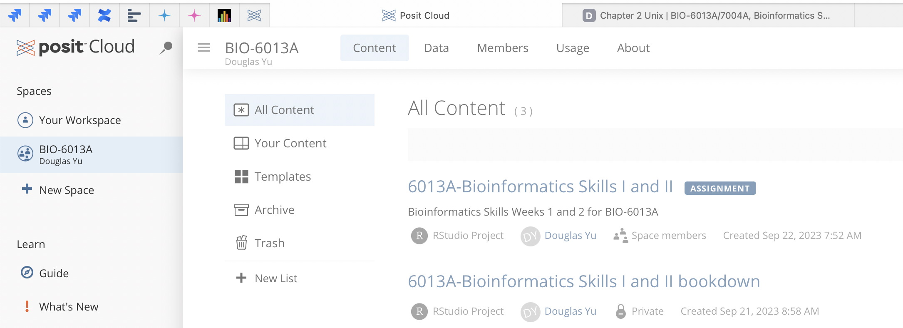
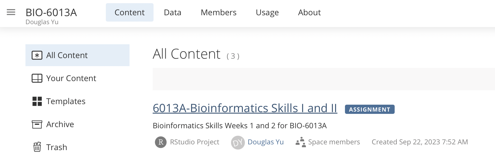
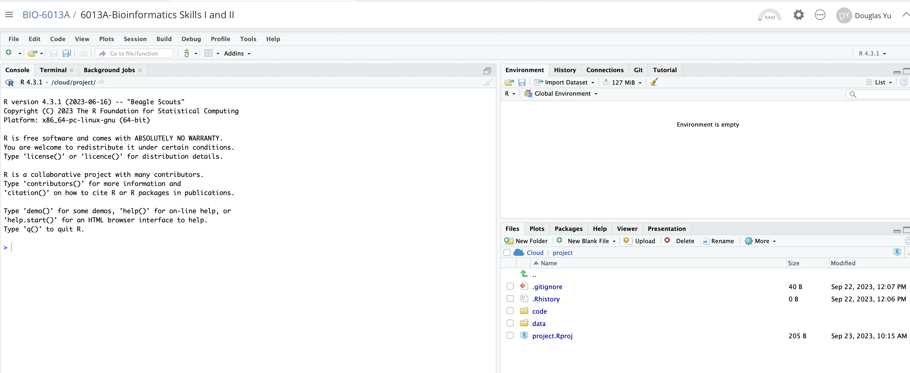
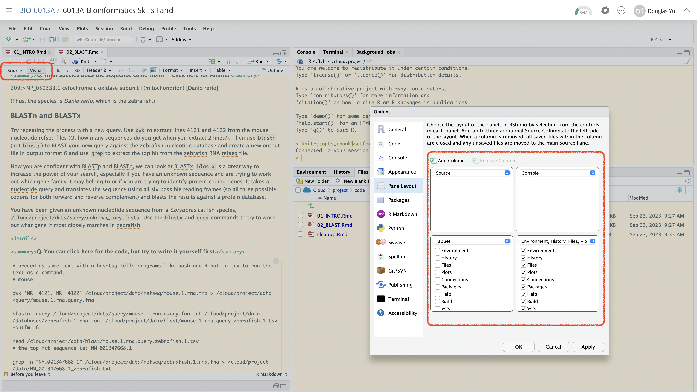

# Introduction

This is a very short introduction to some of the processes and tools we use when working in bioinformatics.

This is not meant to be anywhere near comprehensive; you will be shown a few Unix fundamentals and one walk-through of a single bioinformatics task:  using BLAST to identify nucleotide (DNA) and protein sequences.

One of the main differences between Bioinformatics and the data analysis you have done before is the **size** of the data. Bioinformatics usually deals with sequencing data, which has large file sizes (measured in gigabytes and terabytes).

Handling **big data** means you need to know how to operate on a remote computing cluster, so we will be learning a little bit of how to use a Unix-OS computer.

## Getting started 

These bioinformatics workshops will be run through RStudio Cloud, you will need to make a free account at [posit.cloud](https://posit.cloud/) and join the workspace `BIO 6013A` with this link:

[https://posit.cloud/spaces/83242/join?access_code=ajuk3LeOpqmo8rwXDQpKU-QJYAGgTPUWvF-TqJgZ](https://posit.cloud/spaces/83242/join?access_code=ajuk3LeOpqmo8rwXDQpKU-QJYAGgTPUWvF-TqJgZ). 

Once you have signed up you will see two spaces:

* Your Workspace
* BIO-6013A

```{r, eval=TRUE, echo=FALSE, out.width="90%", fig.alt= "Screen for when you first login to Posit Cloud", fig.cap ="Screen for when you first login to Posit Cloud"}

```

Click on `6013A-Bioinformatics Skills I and II`:

```{r, eval=TRUE, echo=FALSE, out.width="90%", fig.alt= "Click on the 6013A-Bioinformatics Skills I and II workspace", fig.cap ="Click on the 6013A-Bioinformatics Skills I and II workspace link"}

```

Once you are in the workshop, it should look something like this.

```{r, eval=TRUE, echo=FALSE, out.width="90%", fig.alt= "Default RStudio workspace", fig.cap ="Default RStudio workspace"}

```

I strongly suggest that you go to Tools/Global Options and customise the workspace to look like this:

```{r, eval=TRUE, echo=FALSE, out.width="90%", fig.alt= "Customisation of the RStudio workspace", fig.cap ="Customisation of the RStudio workspace"}

```

**DON'T** worry if you don't understand everything

**DO** ask lots of questions!

```{r include=FALSE}
library(tidyverse)
# automatically create a bib database for R packages
knitr::write_bib(c(
  .packages(), 'bookdown', 'knitr', 'rmarkdown'
), 'packages.bib')

knitr::opts_chunk$set(message=FALSE, warning=FALSE, eval=FALSE)
```

```{r klippy, echo=FALSE, eval=TRUE, include=TRUE}
klippy::klippy(c('r', 'bash'), position = c('top', 'right'), tooltip_message = 'copy to clipboard', tooltip_success = 'Copied!')
```
