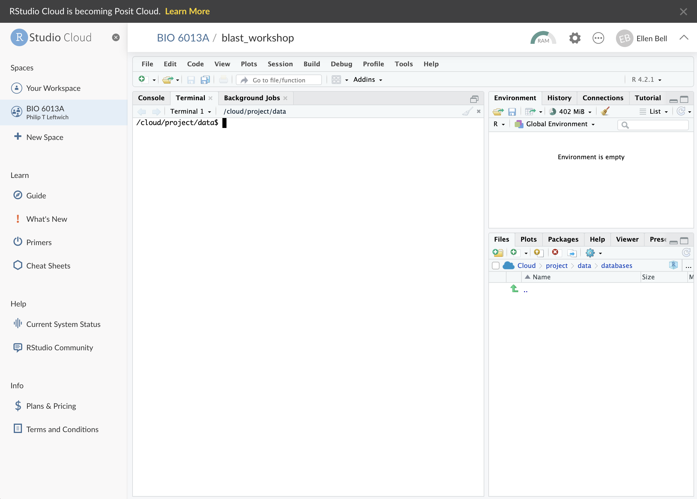

# Introduction

This is a very short introduction to some of the processes and tools we use when working in bioinformatics.

This is not meant to be anywhere near comprehensive; you will be shown a few Unix fundamentals and one walk-through of a single bioinformatics task:  using BLAST to identify DNA and 

One of the *main* differences between Bioinformatics and the data analysis you have done before is the **size** of the data. Bioinformatics usually deals with sequencing data, and this data has large file sizes.

Handling **big data** means you need to know how to operate on a supercomputer so we will be learning a little bit of Linux, processing **big** data into **small** data and then exporting into R to make some more amazing data visuals and interpret our findings!

Here we will start to build a bioinformatics skill set, using the command line.

## Getting started 

These bioinformatics workshops will be run through RStudio Cloud, you will need to make a free account [here](https://rstudio.cloud/) and join the workspace `BIO 6013A` [here](https://rstudio.cloud/spaces/299793/join?access_code=LOpV0oLUk_feSeJSBUUJLOq-qZs7D-gnI2e-3fY3). Once you have signed up you will see that you have two spaces;

* Your Workspace
* BIO 6013A

Make sure you are in the class workspace. 

Open the project marked as __blast_workshop__

Once you are in the workshop it should look something like this;

```{r, eval=TRUE, echo=FALSE, out.width="90%", fig.alt= "Screen for when you first login to RStudio Cloud", fig.cap ="Your blast workshop project in RStudio Cloud"}

```


**DON'T** worry if you don't understand everything

**DO** ask lots of questions!

```{r include=FALSE}
library(tidyverse)
# automatically create a bib database for R packages
knitr::write_bib(c(
  .packages(), 'bookdown', 'knitr', 'rmarkdown'
), 'packages.bib')

knitr::opts_chunk$set(message=FALSE, warning=FALSE, eval=FALSE)
```

```{r klippy, echo=FALSE, eval=TRUE, include=TRUE}
klippy::klippy(c('r', 'bash'), position = c('top', 'right'), tooltip_message = 'copy to clipboard', tooltip_success = 'Copied!')
```
